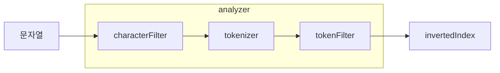

# 애널라이저(Analyzer)
## ✅ 애널라이저(Analyzer)란?
필드값을 토큰(token)으로 변환시켜주는 장치를 보고 애널라이저라고 부른다.

## ✅ 캐릭터 필터(character filter)
캐릭터 필터는 문자열을 토큰으로 자르기 전에 문자열을 다듬는 역할을 한다.

## ✅ 토크나이저(tokenizer)
토크나이저(tokenizer)는 문자열을 토큰으로 자르는 역할을 한다.

## ✅ 토큰 필터(token filter)
토큰 필터는 잘린 토큰을 최종적으로 다듬는 역할을 한다.